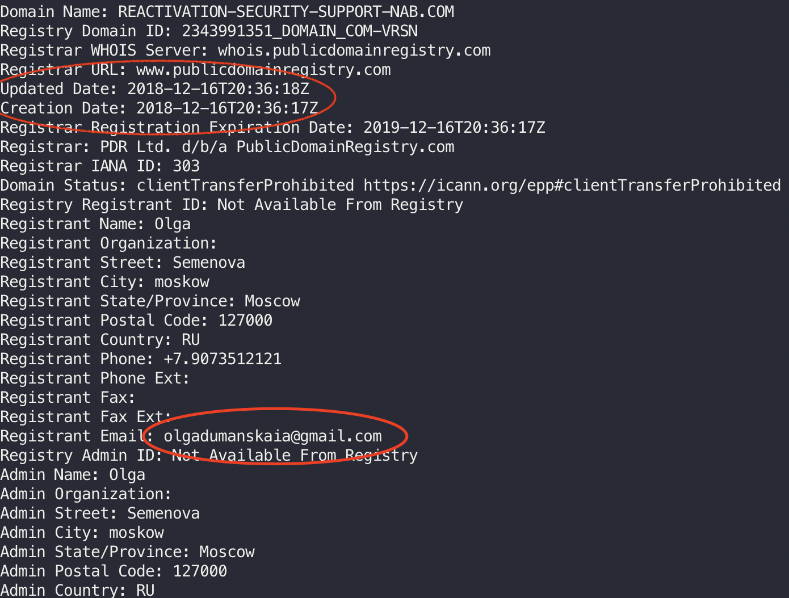
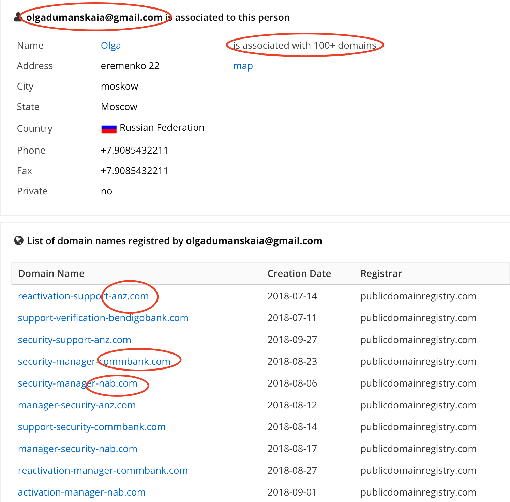
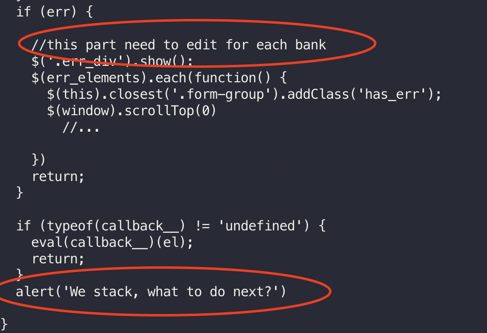
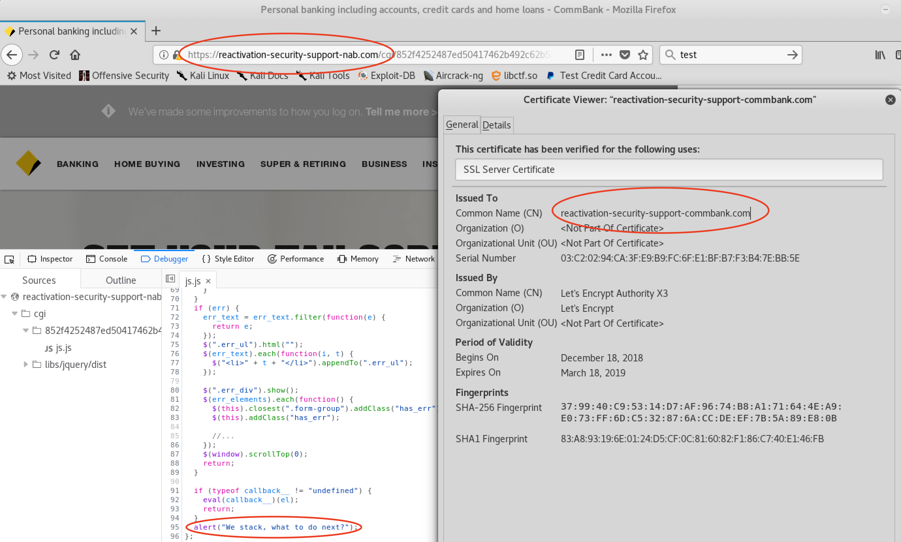
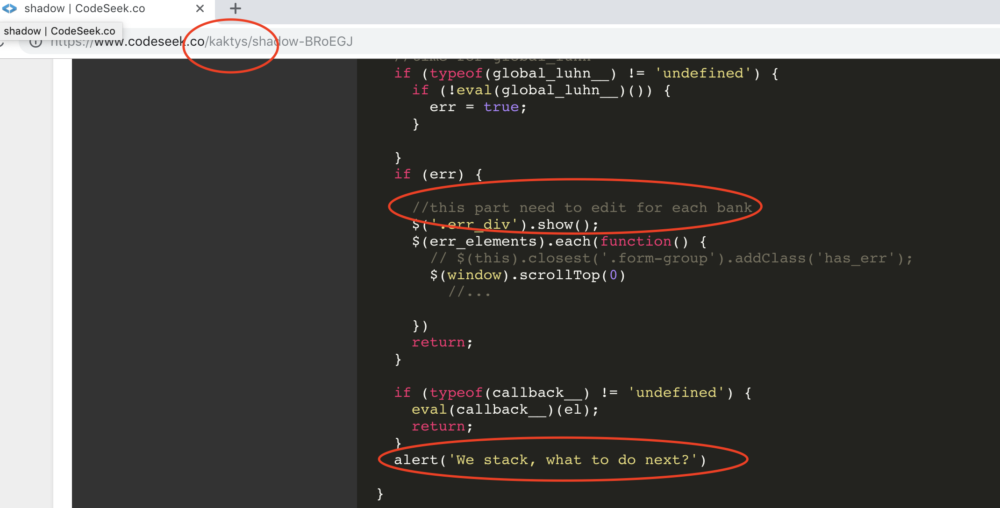

+++
title = "Another phishing attack"
date = 2018-12-19T20:47:42+10:00
draft = false
toc = false
categories = ["breaking"]
tags = ["investigation", "phishing", "OSINT"]
+++

It has been a few months since [I last investigated a phishing attack](/post/investigating-a-phishing-attack). So I got this on my LinkedIn.

I thought it would be fun to do investigate that phishing attack. Here is what I did:

<!--more-->

First things first. Let's see what we can figure out from the domain:

Interesting things to note. The domain date is pretty recent (my investigation occured on 17-18 / 12). That is pretty common for domains used for phishing attacks. They are quickly reported and shutdown (this one specifically was shutdown on 19 / 12).

Another interesting thing is the Register's e-mail: `olgadumanskaia@gmail.com`

A quick google search and it is possible to see all domains related to that e-mail. Note how many fake domains of Australian banks are on that list:

It seems our attacker has a strong focus on Australia banks. At least, when using this e-mail address.

As the last time, I used curl to do a few requests and see what kinda of site it was loading. It was a copy of the NAB website. As usual, I inspected the javascript code before loading the website into a browser. 

The code was a bit messy. The HTML had lots of `ng` attributes which are attribute used by AngularJS. But there was no Angular library or code loaded by the website. There were a few jQuery functions to validate bank accounts but not much. Overall a pretty amateur website. 

There were also a few comments on the codebase. I always keep note of them as they are useful to get more information of the attacker.

After careful inspecting, I concluded it was only a phishing attemp and there were not malicious code being loaded. So I started a VM and loaded the website. It was a bad copy of the NAB website, but yet similar enough to mislead a distracted victim.

At this point, I usually play around with the website to see if I manage to find any other interesting information. However, after a few requests the webserver was down (I didn't have the opportunity to take a screenshot).

After a few minutes it was back again, but now as a CBA website!

That was funny, eh? There are probably different domains pointing to the same server. My hypothesis, is that the attacker was phishing CBA clients at that time. Therefore s/he changed the website to be similar to the CBA one.

While the webserver was down between the transiction from NAB to CBA, I googled the comments on the JS code. Production code might be copy and pasted from different sources. Comments, in the other hand, are usually a good source of information of the author.

I found a codeseek snippet with a _very_ similar code and same comments.

Look at the account that created the snippet. Sounds familiar? It does for me! It is the same account I found when I investigated [a previous phishing attack](/post/investigating-a-phishing-attack).

Coincidence? Maybe. Maybe there are two different attackers, who use code created by `kaktys`. However, if I had to bet, I would say is the same attacker on both attempts. The methodology used was rather similar. SMS, similar domain names, servers on Russia, code shared on codeseek etc. Whoever it is our attacker, it is clear to anyone s/he is aiming at Australia banks. So stay safe people.