+++
title = "Investigating a Phishing Attack"
date = 2018-08-22T22:47:42+10:00
description = "Looking into a phishing attack."
draft = false
toc = false
categories = ["breaking"]
tags = ["investigation", "phishing", "OSINT"]
+++

A friend of mine has received this message recently:

It was obviously phishing. This friend never had a Suncorp account and the domain name is not even similar to the actual domain. Also, part of the URL contained the phone number (which is redacted on the print) and no bank would ever do that! Most people would discard a message like that. Well, I got interested to understand how this phishing attack work so I started to investigate!

<!--more-->

The message is just pretty straightforward asking to click on the link. So I thought it would be interested to learn from it.

First I started with some OSINT by analysing the domain name:

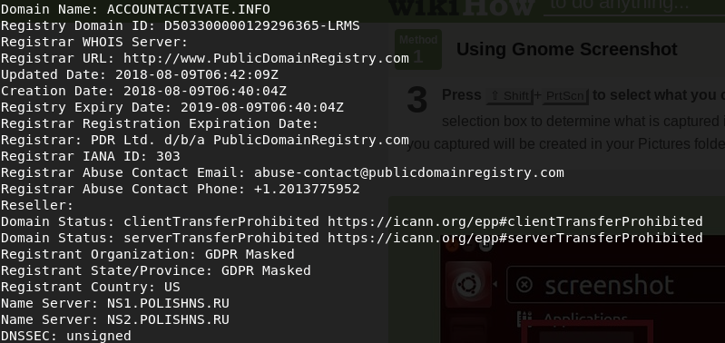

Another sign this is a scam: The domain was created pretty recently and the DNS servers are from Russia (which is weird considering Suncorp is a Australia bank).

Then I looked for DNS records using `dig` command to look at the DNS records.

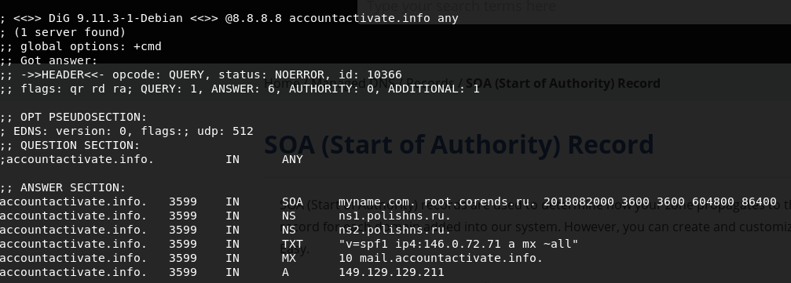

It confirmed the Russian connection and also has an IP, a mail server and that's it. Nothing of note to see here so far. I decided to use some `curl` commands and see what kinda of website that was.

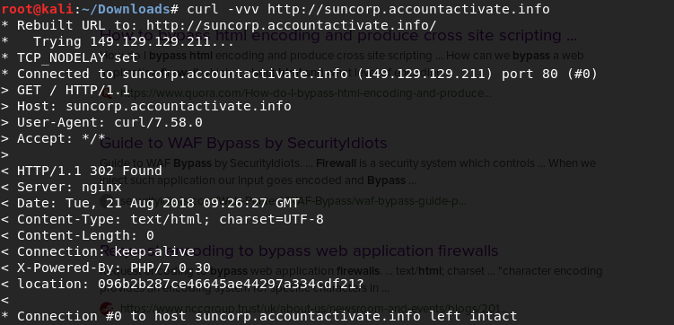

This result was a bit more interesting. The server leaks the web server (nginx) and the language (PHP/7.0.30) used to build the website. It seems our phisher was a bit reckless with their own OPSEC. Or it could be just misleading information. The HTTP response is 302 and it is redirecting to a different location.

I got curious and decided to do a `curl` in the link my friend has received.

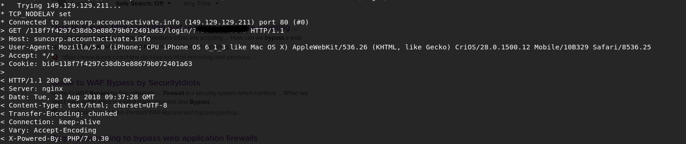

The first `curl` command redirect to a different location, which then redirects to another location and then again once more. Finally, I got to the location `/<uuid>/login/?<phonenumber>`. The UUID seems of no importance, I think it is just a random number to identify the request? Not so sure yet, but it seems randomly generated.

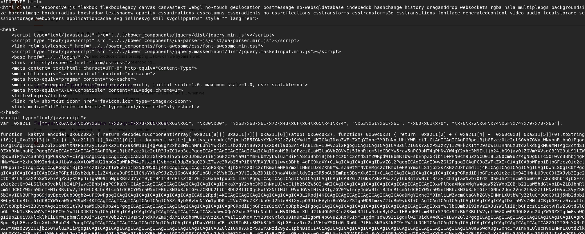

There you go, finally some code! It looks quite complicated tho. It turns out it is just to obfuscate the code. It is an encoded HTML and the mystic codebase only decodes that and renders it. Note there is a special function name in the codebase (_kaktys_encode). We will be back to the function name in a second. For now, let me show the decoded version of the page:

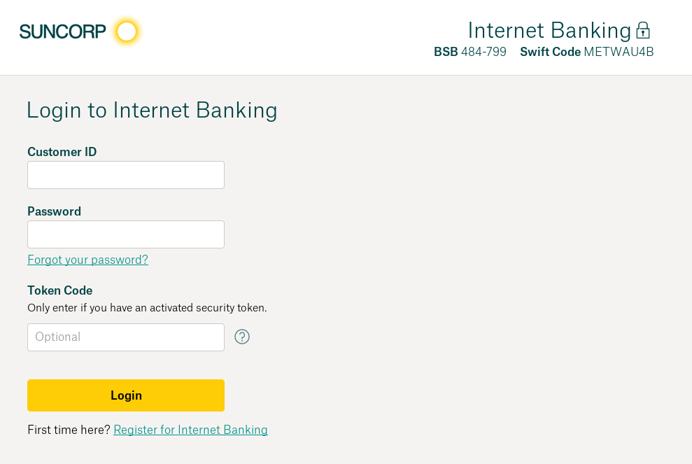

This is a web page quite similar to suncorp internet banking page. Same fonts, same text, same colors, same positioning and etc. If a victim lands to this page for any reason, s/he could easily be tricked to send their username and password to the phisher. The code is simple, it validates some of the inputs (I will talk about this code soon) and then submits those inputs to another server. It also sends some information about the device the victim is using. All this information is stored in a variable called `php_js` (among other things not quite as interesting)

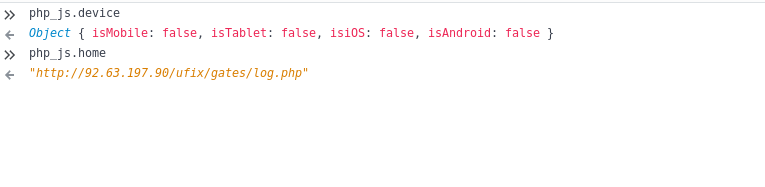

Now we discovered another server! This server does not have a DNS record, it is just an IP somewhere over the internet. From the URL we can assume it is another PHP website (although, that could be misleading as well). Let's see what we can find out from that IP:

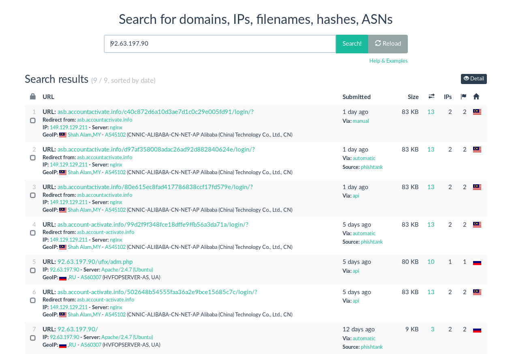

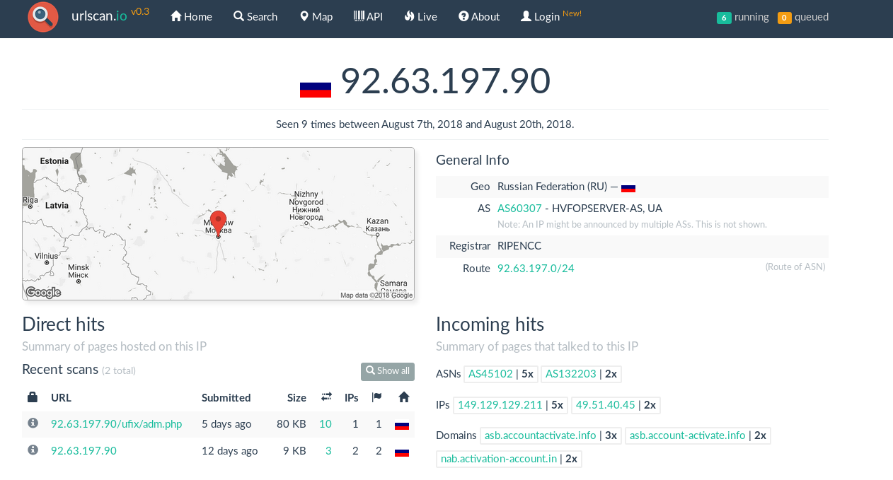

These are [some interesting results](https://urlscan.io/ip/92.63.197.90)! It managed to find out some other domains related to that IP, like `asb.accountactivate.info` (asb is a NZ bank). It also shows us an admin page! It looks like this server is kinda of a central piece of many phishing campaigns. Let's see what is in the admin page:

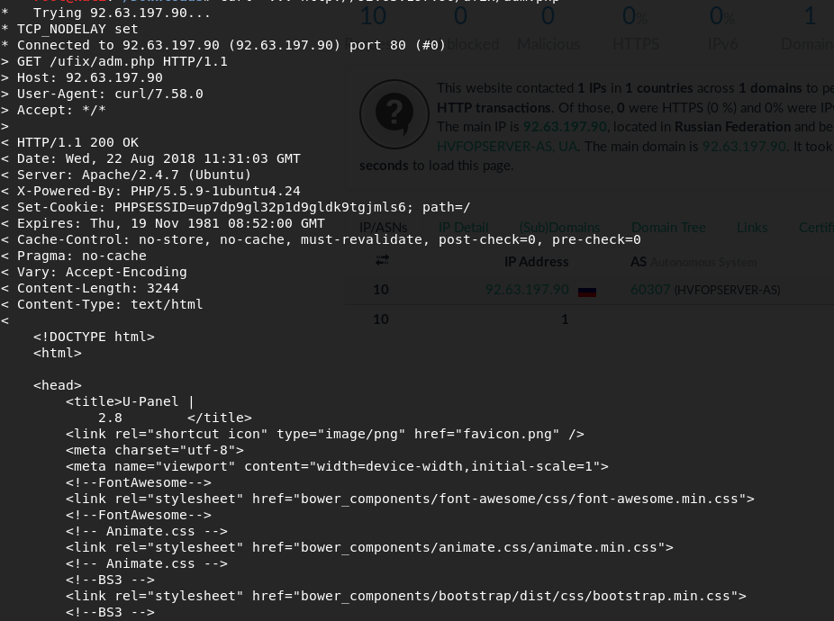

Again I used curl first to see the HTML. Not interesting to find here except for a login page. Unfortunately, there was nothing else I could figure out from that domain. There is where my research ends. Or is it? Remember that funny function name? Well, turns out if you google for it, you will find out there are many accounts that use it as a handle. From game websites to code ones. Of course, that does not mean much. But this is interesting though:

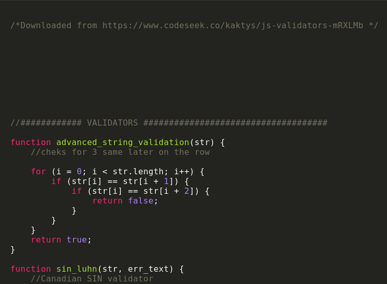

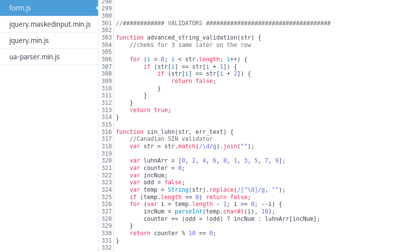

The [code snippet](https://www.codeseek.co/kaktys/js-validators-mRXLMb) hosted by `kaktys` account, it is precisely the same code used in the fake suncorp web page. It is an interesting coincidence, isn't it? It could be just a coincidence. Or not. I will leave this as an exercise for the reader.

Funnily enough, I wasn't the only one investigating this phisher. [Somebody else did the same](https://isc.sans.edu/forums/diary/A+Phishers+View+of+Phishing+UAdmin+27+Phishing+Control+Panel/23543/) a few months ago (at that time the phisher was targeting NAB accounts). It is an interesting read.

Unfortunately (or fortunately) the domain was shut down a few days after I started to investigate. Because of that, I couldn't investigate as much as I would like to. However, it seems our phisher adapts very well to that reality. They create other domains as quickly as they are shut down. The phishing business is one that changes rapidly and we need to be vigilant to keep up ourselves protected against it.